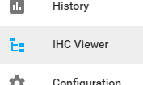

# Home Assistant IHC Viewer

[](https://github.com/custom-components/hacs)

This is a IHC viewer custom component for Home Assistant.

[Read more about on my blog here](https://www.dingus.dk/ihc-viewer-for-home-assistant/)

To use it, the easist way is to install it with HACS. Add this repo as a Custom Repository in HACS and install it.

Without HACS you will have to place the custom_components folder in your HA configuration folder.

Either way, in the configuration.yaml file insert this:

```yaml
ihcviewer:
```

And you MUST have [IHC configured in Home Assistant](https://www.home-assistant.io/integrations/ihc/).

You will get a new menu item:



And you can view your IHC project:


## Contribute to project and developing with a devcontainer

1. Fork and clone the repository.
2. Open in VSCode and open in a devcontainer.
3. Create a secrets file in .devcontainer/secrets.yaml with content

   ```yaml
   ihc_url: "http://192.168.1.3" # Your IHC address
   ihc_username: YOUR_USERNAME
   ihc_password: YOUR_PASSWORD
   ```

4. Run the command `dc start` from VSCode terminal
5. Home Assistant test instance will install and will eventually be running on port `9123`

## License

IHC Viewer is free software: you can redistribute it and/or modify
it under the terms of the GNU General Public License as published by
the Free Software Foundation, either version 3 of the License, or
(at your option) any later version.

IHC Viewer is distributed in the hope that it will be useful,
but WITHOUT ANY WARRANTY; without even the implied warranty of
MERCHANTABILITY or FITNESS FOR A PARTICULAR PURPOSE. See the
GNU General Public License for more details.

You should have received a copy of the GNU General Public License
along with HAIhc. If not, see <http://www.gnu.org/licenses/>.
